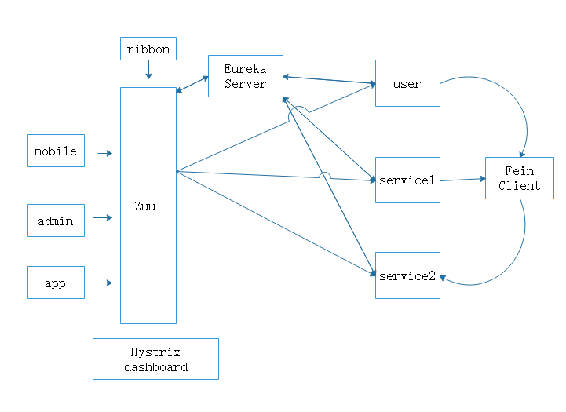
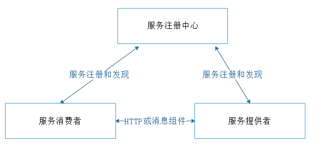

# Springboot-Dubbo-Zookeeper

## 实践微服务的主流方案与分析
- 方案一：Spring Cloud Netflix
- 方案二：Spring Cloud Alibaba
- 方案三：Springboot + Dubbo

### 方案一：Spring Cloud Netflix
Spring Cloud Netflix是Spring家族推出一款微服务框架，它作为 Java开发的微服务框架，可以配合Spring Boot来进行快速开发，可以实现快速开发、持续交付和持续部署。Spring Cloud 有着非常多的组件，覆盖了微服务的许多方面，在Netflix、 Pivotal 两大公司的推动下也变得越来越完善。是市面上很多互联网公司也在使用的微服务方案，下图是Spring Cloud  微服务框架整体组件架构图。

#### 图中组件： 
- APP、Admin、Mobile代表不同机器上的客户端 
- Zuul：它是微服务的Gateway，也就是网关，主要的功能是网络路由。不同客户端需要调用后端系统，将统一从这个网关入口进入，通过网关转发请求给到相应的服务。
- Eureka：作为微服务架构中服务注册与发现中心，Eureka的核心工作是负责多个服务的注册与发现。每个服务启动时，服务提供者Eureka客户端都会往Eureka服务端进行注册，将自己的服务名和IP地址等给到Eureka服务端，同时Eureka客户端可以从Eureka服务端拉取注册表，该注册表包含了所有往服务注册中心注册的服务信息。

- Feign：可以实现服务间的调用，但不做任何请求处理。Feign通过动态代理机制，处理注解生成请求模板，拼接请求URL地址，生成真正的请求。
- Ribbon： Ribbon是用作服务消费者的负载均衡器来用的，系统会根据情况从一个服务的多台机器中选择一台来对外消费。
- Hystrix：Hystrix提供了熔断器功能。请求会先通过Hystrix，如果服务不可用，可以通过隔离服务的访问点防止导致整个系统发生故障不同服务，从而避免了服务雪崩的问题。
  优缺点：Spring Cloud Netflix考虑到了微服务的方方面面，无论从成熟度还是社区热度或者可维护性方面都是比较优秀的。利用Spring Cloud Netflix可以实现快速构建分布式系统，包括api网关、服务注册与发现、熔断器等等，并且还可以配合Springboot做到一键启动和部署。从2018 年 12 月 12 日开始，Netflix 公司对外宣布维护Spring Cloud Netflix 系列技术栈，Spring Cloud Netflix的服务通信是基于http协议的，在通信速度上不如RPC通信。

### 方案二：Spring Cloud Alibaba
  Spring Cloud Alibaba 是Spring团队和阿里巴巴团队联合开发的微服务框架，Spring Cloud Alibaba目的在于提供微服务开发的一站式解决方案。Spring Cloud Alibaba包含了开发分布式应用微服务的必需组件，Developer们可以很方便的通过 Spring Cloud  微服务模型规范来使用Spring Cloud Alibaba中的组件来开发分布式应用服务。
  利用Spring Cloud Alibaba微服务解决方案，仅仅要增加一些注解和配置，就可以将 Spring Cloud  微服务模型接入Alibaba的分布式应用解决方案，利用阿里中间件来快速搭好分布式应用程序。

  Spring Cloud Alibaba 和Spring Cloud Netflix 架构上大体相似，不同的是实现Spring Cloud 微服务规范的组件不同。
  Spring Cloud Alibaba的主要组件包括以下：
- Sentinel：流量是sentinel的切入点，从多个维度保护服务的稳定性，包括流量控制、熔断降级、系统负载保护等。
- Nacos：它是一个动态服务发现、配置管理和服务管理平台。方便开发者们更便捷地构建云原生应用。
- AliCloud OSS：它是阿里巴巴平台的云对象存储服务，也叫Object Storage Service，简称 OSS，它依靠阿里云平台能够给企业或开发者提供海量、安全、低成本、高可靠的云存储服务。存储和访问任意类型的数据不受时间、地点和应用的限制等组件。
	优缺点：Spring Cloud Alibaba 是采用了阿里中间件对Spring Cloud微服务生态规范的实现，Spring Cloud Alibaba完整的原始中文文档和本地化开源服务为开发的学习提供了非常高的便利度，降低学习成本和后续的运维难度。目前只有一个0.2.0release版本，使用者较少，后期更新迭代速度可能比较快，相对地不稳定。

### 方案三：Springboot + Dubbo
  Dubbo是基于RPC的通信框架，用Dubbo去实现微服务，需要集成api网关、服务注册与发现中心等。Springboot则为微服务提供了快速开发的功能。
优缺点：基于Dubbo去实践微服务可以有效提高通信效率。因为Dubbo是基于RPC通信的，与传统http不同，它的通讯效率会明显的提高。但是缺点就是需要手动去集成api网关、服务注册与发现中心等。但是鉴于阿里巴巴淘宝的架构曾经采用Dubbo去做，所以事实能够证明Dubbo是能抗住压力的。所以本次研究也决定采用Springboot + Dubbo + Zookeeper 来实践微服务。事实上微服务主要要解决几个问题。客户端访问众多服务的问题，服务间通信问题。服务崩溃问题，服务管理问题。

